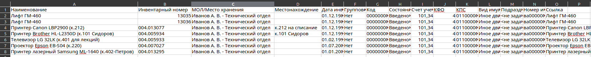
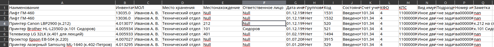

1) Опробовать несколько моделей NER
    1) Llama 2 нужна более мощная модель или проработаннее промпт
    2) Spacy нет встроенного функционала для извлечения аудиторий, распознавание имен очень корявое
    3) Извлечение на основе регулярок, не самый гибкий но довольно рабочий подход
## Что реализовано
1) ### Преобразование таблиц
ExcelTableTransformer — класс для обработки таблиц старого формата:
Извлекает данные из старых Excel-файлов.
Преобразует формат данных в новый с использованием моделей NER.
Сохраняет результат в Excel-файл с новой структурой.
2) ### Извлечение сущностей (NER)
- RegexNamedEntityRecognizer:
Использует регулярные выражения для извлечения данных, таких как:
Номера кабинетов (например, к.301 или каб.301).
Ответственные лица (например, ФИО в разных форматах).
- Эксперименты с LLaMA:
Протестирована возможность использования модели LLaMA для задач NER, включая генерацию и проверку предсказаний.
- Эксперименты с spaCy:
Настроена модель spaCy для русского языка (ru_core_news_lg).
Реализована адаптация модели для обучения на специализированных данных (например, имена, номера кабинетов).

### Визуализация проделанной работы
**Из**

**Получено**
